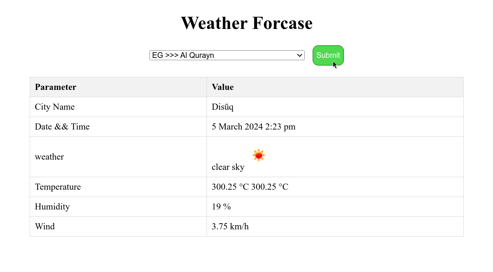

# Egyptian Cities Weather Report

This PHP script generates a weather report for a selected Egyptian city. It utilizes cURL to fetch weather information from a weather API.

## Prerequisites

- PHP installed on your server.
- cURL extension enabled in PHP.

## Installation

1. Clone this repository or download the ZIP file.
2. Upload the contents to your web server.

## Usage

1. Navigate to the directory where you uploaded the files.
2. Open `index.php` in a text editor.
3. Replace `YOUR_API_KEY` with your actual API key in the cURL request.
4. Save the file.
5. Access `index.php` in your web browser.
6. Choose an Egyptian city from the dropdown menu.
7. Click on the submit button.

## Before Submit

- Select a city from the dropdown menu.
## Output Example

## After Submit

- You will receive a weather report for the selected city, including minimum and maximum temperature, and humidity.
## Output Example

## API Used

This script utilizes the [Weather API](https://example.com/api/docs) to fetch weather information.

