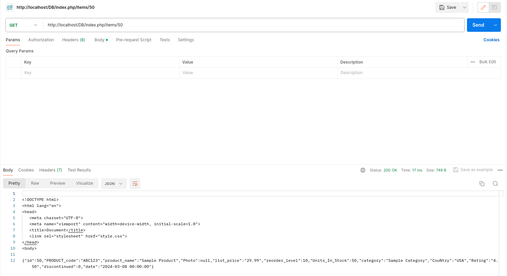
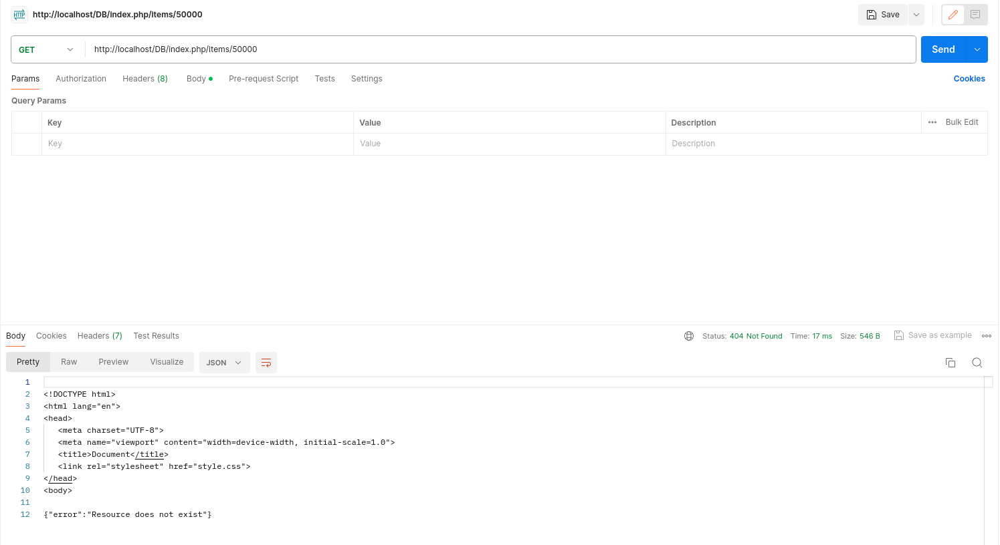
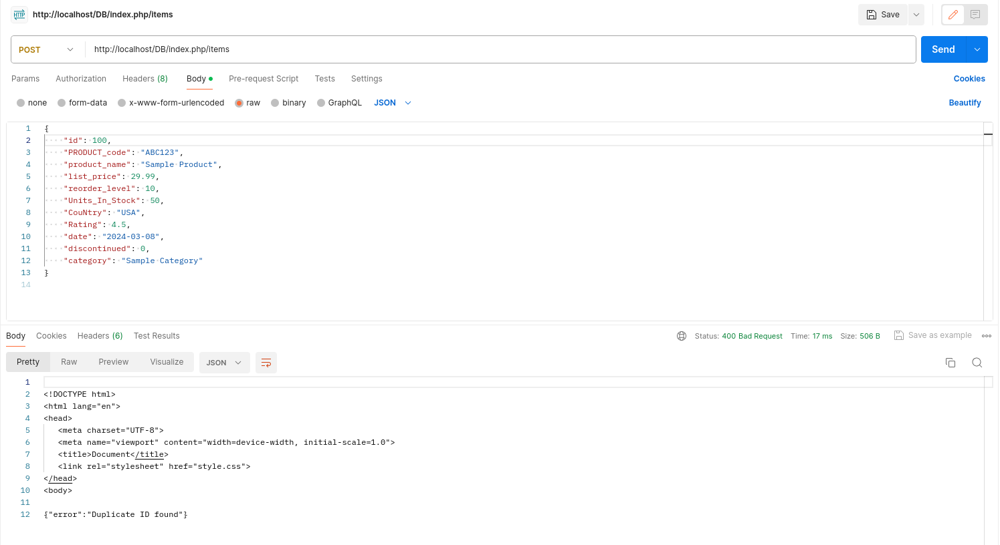

# Lab_2 WebService (Rest API)
## Description
This repository contains a simple RESTful API for managing items in a shop. The API allows users to perform CRUD operations on items in the shop's inventory.

## Implementation Notes
1. Use `products.sql` file to import products to your database.
2. Utilize the `MySQLHandler` class to interact with the database efficiently. This class provides methods for select, update, delete, and insert operations.

## API Endpoints
### Get Item by ID
- **URL**: `http://localhost/ShopAPI.php/items/{id}`
- **Method**: `GET`
- **Description**: Retrieves details of an item by its ID.
- **Response**: 
  - If ID is correct:
    ```json
    {
        "id": "100",
        "name": "new_glass very new1",
        "price": "14.00",
        "units_in_stock": "4"
    }
    ```
  - If ID is incorrect: 
    ```json
    {
        "error": "Resource doesn't exist"
    }
    ```
    Result code: 404
- **Error Handling**:
  - If the database connection fails: 
    ```json
    {
        "error": "Internal Server Error!"
    }
    ```
    Status: 500

### HTTP Verbs Handling
- **Description**: Allows only `GET` and `POST` HTTP verbs.
- **Response**:
  - If any other HTTP verb is used:
    ```json
    {
        "error": "Method not allowed!"
    }
    ```
    Status: 405

## Output Images
- Insert images of API response examples here.

## Sample Output Images


*Figure 1: Screenshot of the Postman page displaying testing POST method.*





*Figure 1: Screenshot of the Postman page displaying testing GET method.*


*Figure 1: Screenshot of the Postman page displaying testing that the user entered a valid method.*





*Figure 1: Screenshot of the Postman page displaying testing that the user entered a exist ID.*





*Figure 1: Screenshot of the Postman page displaying that the user entered a unique ID during POST method.*

